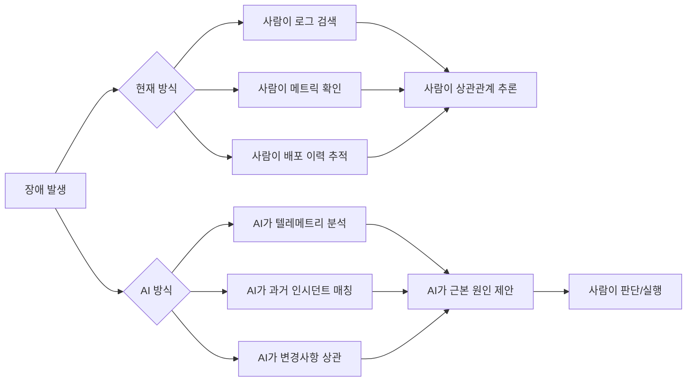
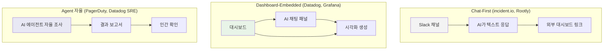
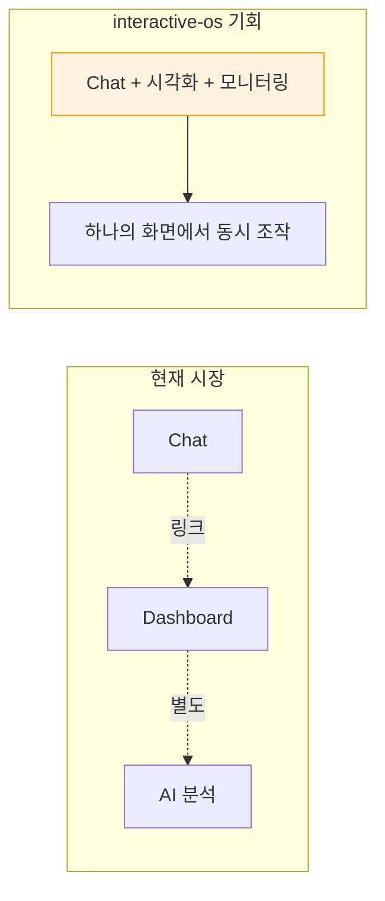

# AI Incident Management UI — 장애 도구들이 LLM/AI를 시각화와 조작에 엮는 방향

> 작성일: 2026-03-26
> 맥락: interactive-os 기반 장애 모니터링 도구 구상에 앞서, 시장의 AI+시각화 통합 방향을 파악

> **Situation** — 장애 대응 도구들이 2025년부터 AI/LLM을 본격 통합하고 있다. PagerDuty, Datadog, Grafana, incident.io, Rootly 등 주요 플레이어 모두 AI 기능을 출시했다.
> **Complication** — 그런데 대부분의 AI 통합은 **Slack 채팅봇 + 자연어 요약** 수준에 머물러 있다. "시각화와 AI가 하나의 화면에서 동시에 작동하는" 인터페이스는 아직 미성숙하다.
> **Question** — AI 장애 도구의 UI는 어디까지 왔고, "MCP/CLI로는 안 되는" 시각적 인터페이스의 차별화 지점은 어디인가?
> **Answer** — 현재 시장은 "Chat-first → Dashboard 연결" 단계다. Chat과 시각화가 진정으로 융합된 인터페이스는 아직 빈 자리이며, 이것이 interactive-os의 차별화 기회다.

---

## Why — AI가 장애 도구에 들어오는 이유

장애 대응은 본질적으로 **시간 압박 하의 정보 탐색** 문제다:

1. **인지 부하**: 장애 발생 시 로그, 메트릭, 트레이스, 배포 이력, 과거 인시던트를 동시에 살펴야 한다
2. **컨텍스트 스위칭**: 평균적으로 3~5개 도구를 오가며 원인을 추적한다
3. **반복 패턴**: 장애의 70~80%는 과거와 유사한 패턴이다

AI가 해결하는 것: **정보 수집과 상관관계 파악의 자동화**. 2025 SolarWinds 보고서에 따르면, AI 장애 도구가 인시던트당 평균 4.87시간을 절약한다 — 인지 부하 감소, 조사 속도, 일관된 사후 학습의 세 영역에서.



---

## How — 주요 플레이어들의 AI 통합 방식

### 1. Chat-First 모델 (Slack/Teams 기반)

**대표**: incident.io, Rootly, PagerDuty

| 특징 | 설명 |
|------|------|
| 인터페이스 | Slack 채널 = 인시던트 룸 |
| AI 역할 | 채팅 참여자로 동작. 요약, 제안, 자동 분류 |
| 시각화 | 거의 없음. 텍스트 기반 요약 + 링크로 외부 대시보드 연결 |
| 강점 | 도구 전환 없이 기존 워크플로우에 삽입 |
| 한계 | **동시 정보 비교 불가**. 직렬적 Q&A만 가능 |

**incident.io의 접근:**
- "talk to incident.io like any other responder" — 자연어로 대화
- 자동 인시던트 명명, 요약 제안, 후속 조치 제안
- AI SRE가 80% 자동 대응을 표방
- 하지만 핵심 인터페이스는 **Slack 채널** — 시각적 탐색은 별도 웹 UI

**Rootly의 접근:**
- Slack-native 워크플로우 자동화
- 자동 타임라인 캡처 → 포스트모템 생성
- Web Copilot이 차트 생성, 인시던트 히스토리 쿼리
- 시각화는 있지만 **분석 후 보고** 용도

### 2. Dashboard-Embedded AI 모델

**대표**: Datadog (Bits AI), Grafana (Assistant)

| 특징 | 설명 |
|------|------|
| 인터페이스 | 기존 대시보드 안에 AI 채팅 패널 삽입 |
| AI 역할 | 자연어 → 쿼리/대시보드 생성, 맥락 요약 |
| 시각화 | 기존 시각화(그래프, flame graph 등)와 AI 응답이 공존 |
| 강점 | 시각화 맥락 안에서 AI 질문 가능 |
| 한계 | AI가 시각화를 **생성**하지만 **조작**하지는 않음 |

**Datadog Bits AI:**
- 웹앱 어디서든 접근 가능한 채팅 윈도우
- 자연어 → 트레이스 쿼리 → flame graph 드릴다운
- 대시보드 검색/생성 가능
- **Bits AI SRE**: 알림을 백그라운드에서 자동 조사, 결과를 모바일/Slack에 전달
- **Data Analyst**: 자연어 → 노트북 셀(쿼리+변환+시각화)을 단계별 생성
- **실행 흐름도(Execution Flow Chart)**: AI 에이전트의 의사결정 경로를 시각화

**Grafana Assistant:**
- 채팅 기반 쿼리 작성 + 대시보드 생성
- **Assistant Investigations**: 인시던트/알림 → 자동 다단계 조사
- knowledge graph로 메트릭/로그/트레이스/프로필 신호를 연결
- flame graph에 AI 분석 오버레이
- human-in-the-loop 설계 철학

### 3. 에이전트 자율 모델 (신흥)

**대표**: PagerDuty AI Agent Suite, Datadog Bits AI SRE

| 특징 | 설명 |
|------|------|
| 인터페이스 | 에이전트가 자율 조사 후 결과를 인간에게 전달 |
| AI 역할 | 진단 + 실행까지 자동화 (runbook, 배포 롤백 등) |
| 시각화 | 결과 보고서 형태. 실시간 탐색보다는 사후 확인 |
| 강점 | 인간 개입 최소화 |
| 한계 | **블랙박스** — 에이전트가 뭘 했는지 추적하기 어려움 |

**PagerDuty AI Agent Suite (2025 H2):**
- SRE Agent: 관련 인시던트 학습, 진단 실행, self-updating runbook 생성
- Scribe Agent: Zoom/Slack 자동 전사 + 구조화된 요약
- Insights Agent: 분석 기반 능동적 추천
- MCP 서버 GA — 양방향 AI 에이전트 연결



---

## What — 구체적 UI 패턴들

### 패턴 1: Conversational Discovery (대화형 발견)

Datadog Bits AI의 핵심 패턴. 사용자가 질문하면 AI가 기존 데이터 자산을 찾아서 보여준다.

```
사용자: "event-processor 서비스 상태 대시보드 보여줘"
Bits AI: [대시보드 링크 + 요약 표시]

사용자: "최근 트레이스에서 느린 거 찾아줘"
Bits AI: [트레이스 쿼리 결과 + flame graph 드릴다운]
```

**특징**: AI가 시각화를 **검색/생성**하지만, 사용자의 직접 조작과는 분리되어 있다.

### 패턴 2: Investigation Timeline (조사 타임라인)

Rootly, Grafana Sift의 핵심 패턴. 인시던트 발생부터 해결까지의 이벤트를 시간순으로 시각화한다.

- 자동 이벤트 캡처 (배포, 알림, 대응 행동)
- 단일 시간축 위에 다중 소스 데이터 배치
- AI가 타임라인에 주석(annotation) 추가

### 패턴 3: Step-by-Step Notebook (단계별 노트북)

Datadog Data Analyst의 접근. 자연어 요청 → 노트북 셀로 분해.

```
사용자: "지난주 API 레이턴시 급증 원인 분석해줘"
AI: [셀 1: 레이턴시 메트릭 쿼리]
    [셀 2: 에러 로그 필터링]
    [셀 3: 배포 이벤트 상관]
    [셀 4: 시각화 + 결론]
```

### 패턴 4: AI Linter / Proactive Annotation (능동적 주석)

Transluce Monitor, Grafana의 접근. AI가 대시보드를 자동 감시하고, 이상을 발견하면 인라인으로 주석을 삽입한다.

### 패턴 5: Split-Screen Chat + Visualization (분할 화면)

Lazarev.agency의 AI 대시보드 설계 원칙에서 제시한 패턴:

1. **대화형 입력 + 구조화된 출력**: 자연어 쿼리 → 이동 가능한 위젯(테이블, 차트)으로 변환
2. **출처 투명성**: AI 인사이트 옆에 데이터 소스/분석 관점을 표시
3. **인사이트 → 산출물 변환**: 대시보드 발견 → 리포트/메모로 바로 변환 (화면 이탈 없이)

---

## If — 프로젝트에 대한 시사점

### 시장의 빈자리

현재 시장의 AI 장애 도구는 세 가지 계층으로 나뉘는데, **각 계층의 한계가 명확하다**:

| 계층 | 한계 | 빈자리 |
|------|------|--------|
| Chat-First | 동시 정보 비교 불가, 시각화 없음 | 채팅 + 시각화 융합 |
| Dashboard-Embedded | AI가 시각화를 생성만, 조작은 분리 | AI 응답이 시각화와 **상호작용** |
| Agent 자율 | 블랙박스, 사후 확인만 | 에이전트 행동의 **실시간 시각적 추적** |

### interactive-os가 차별화될 수 있는 지점



**1. 동시성 (Concurrency)**
- 현재: 채팅과 시각화가 분리 (Slack → 대시보드 → 다시 Slack)
- 기회: 모니터링이 돌아가는 화면에서 AI와 대화하면서 시각화를 조작

**2. 직접 조작 (Direct Manipulation)**
- 현재: AI가 시각화를 **생성**해주고, 사용자가 별도로 탐색
- 기회: AI 응답이 타임라인의 특정 지점을 하이라이트하고, 키보드로 해당 지점으로 점프

**3. 맥락 연속성 (Context Continuity)**
- 현재: 각 도구/패널이 독립적 상태를 가짐
- 기회: 엔티티 스토어가 모니터링 데이터, AI 분석 결과, 사용자 탐색 상태를 하나의 모델로 관리

**4. 키보드 우선 탐색**
- 현재: 마우스 클릭 기반 대시보드
- 기회: 장애 대응 = 시간 압박. 키보드로 타임라인 이동, 서비스 전환, AI 질문이 빠르다

### interactive-os 대응 매핑

| 장애 도구 기능 | 필요한 인터랙션 | interactive-os 대응 |
|--------------|---------------|-------------------|
| 장애 타임라인 탐색 | 시간축 이동, 확장/축소, 멀티 레인 | TreeGrid + spatial navigation |
| 서비스 의존성 탐색 | 그래프 네비게이션, 포커스 전환 | multi-zone + cross-boundary |
| AI 대화 | 스트리밍 응답, 블록 UI, 인라인 위젯 | Command + Plugin |
| 캡쳐 비교 | 다중 패널, before/after | multi-view + Entity store |
| 실시간 모니터링 | 상시 갱신, 상태 뱃지 | Entity store + 선언적 뷰 |
| 알림 트리아지 | 목록 탐색, 빠른 판단 | ListBox + 키보드 단축키 |

---

## Insights

- **Chat-First의 천장**: Slack 기반 도구들은 "대화"는 잘하지만 "탐색"을 못 한다. 장애 대응의 핵심은 대화가 아니라 **다중 신호의 동시 비교**인데, 텍스트 인터페이스로는 구조적으로 불가능하다. incident.io가 80% 자동 대응을 표방하지만, 나머지 20%의 복잡한 장애가 실제로 시간과 비용을 먹는다.

- **"AI가 대시보드를 만든다" ≠ "AI와 대시보드가 하나다"**: Datadog의 Bits AI Data Analyst가 노트북 셀을 생성하는 건 인상적이지만, 생성된 시각화를 사용자가 조작하면서 동시에 AI와 대화하는 경험은 아직 없다. 생성과 조작이 분리되어 있다.

- **에이전트 자율 모델의 역설**: PagerDuty AI Agent Suite처럼 에이전트가 자율 조사하는 방향은 인간 개입을 줄이지만, **신뢰 문제**를 만든다. "에이전트가 뭘 했는지"를 투명하게 보여주는 시각적 인터페이스가 필수적인데, 현재 이 부분이 가장 약하다. Transluce Monitor의 "provenance + attribution" 접근이 유일한 시도.

- **5가지 AI 대시보드 설계 원칙** (Lazarev.agency): (1) 대화형 입력 + 구조화된 출력, (2) 출처/관점 투명성, (3) 사용자 설정 보존, (4) 최단 명확성 경로, (5) 인사이트 → 산출물 화면 내 변환. 이 원칙들은 interactive-os의 Command + Plugin 아키텍처와 자연스럽게 대응한다.

- **MCP 서버 GA가 의미하는 것**: PagerDuty가 MCP 서버를 GA로 출시한 건, "AI 에이전트가 장애 도구를 조작하는" 방향이 산업 표준이 되고 있다는 신호다. 하지만 MCP는 **프로그래매틱 연결**이지, **시각적 경험**이 아니다. "MCP로 가능한 것"과 "눈으로 봐야 하는 것"의 경계가 바로 interactive-os의 영역이다.

---

## Sources

| # | 출처 | 유형 | 핵심 내용 |
|---|------|------|----------|
| 1 | [PagerDuty AI Agent Suite](https://www.pagerduty.com/newsroom/2025-fall-productlaunch/) | 공식 발표 | 업계 최초 End-to-End AI 에이전트 스위트, MCP 서버 GA |
| 2 | [Datadog Bits AI](https://www.datadoghq.com/blog/datadog-bits-generative-ai/) | 공식 블로그 | Bits AI 채팅 인터페이스, conversational discovery 패턴 |
| 3 | [Datadog DASH 2025](https://www.datadoghq.com/blog/dash-2025-new-feature-roundup-keynote/) | 공식 발표 | 실행 흐름도, Bits AI SRE/Data Analyst, 노트북 기반 조사 |
| 4 | [Grafana AI Tools](https://grafana.com/products/cloud/ai-tools-for-observability/) | 공식 문서 | Assistant Investigations, knowledge graph, human-in-the-loop |
| 5 | [Grafana Sift](https://grafana.com/docs/grafana-cloud/alerting-and-irm/irm/use/incident-management/investigate-with-sift/) | 공식 문서 | Sift 자동 진단, 타임라인 시각화 |
| 6 | [incident.io AI Platform](https://incident.io/ai-platform) | 공식 문서 | AI SRE 80% 자동화, chat-native UX, Scribe 전사 |
| 7 | [Rootly AI](https://rootly.com/sre/rootlys-ai-powers-future-incident-management-2025) | 공식 블로그 | 자동 타임라인 캡처, Web Copilot 시각화 |
| 8 | [Transluce Monitor](https://transluce.org/observability-interface) | 연구 | AI-driven observability: provenance, attribution, steering |
| 9 | [AI Dashboard Design Principles](https://www.lazarev.agency/articles/ai-dashboard-design) | 디자인 | 5원칙: 대화+구조화, 출처 투명성, 인사이트→산출물 |
| 10 | [AI Incident Management Trends 2026](https://www.xurrent.com/blog/ai-incident-management-observability-trends) | 분석 | 반응→예측 전환, 에이전트 AI 채택 가속 |

---

## Walkthrough

> 이 조사를 바탕으로 interactive-os 기반 장애 도구를 구상하려면?

1. **현재 데모 확인**: 팀장이 만든 Playwright 감시 + 이미지 캡쳐 분석 1page 데모를 실행해본다
2. **차별화 지점 식별**: 데모에서 "채팅으로만 가능한 것" vs "화면이 있어야 가능한 것"을 구분한다
3. **핵심 시나리오 3개**: (1) 장애 타임라인 탐색, (2) 캡쳐 비교 + AI 분석, (3) 실시간 모니터링 + 알림 트리아지
4. **프로토타입**: 위 3개 시나리오를 interactive-os 위에서 하나의 화면으로 엮는 PoC를 만든다
5. **데모 임팩트 검증**: "이 화면은 Slack 봇으로 안 된다"가 3초 안에 전달되는지 확인한다
