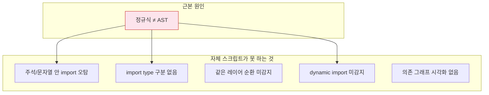
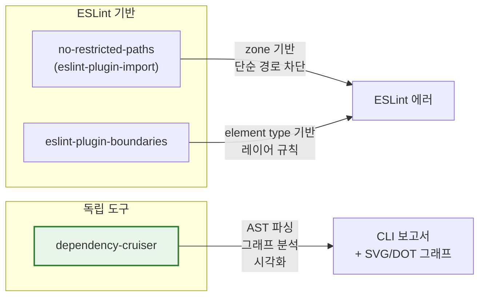

# TS 레이어 의존성 강제 도구 — 자체 스크립트 vs 표준 도구

> 작성일: 2026-03-26
> 맥락: checkLayerDeps.mjs 자체 스크립트(147줄)로 레이어 역참조를 감지 중. 표준 도구로 교체 가능한지 조사.

> **Situation** — 자체 정규식 스크립트로 import를 파싱하여 레이어 역방향을 감지하고 있다. 실제 위반을 발견하고 해결하는 데 기여했다.
> **Complication** — 주석/문자열 안 import 오탐, type-only 미구분, 같은 레이어 순환 미감지 등 빈틈이 있다. 정규식 파싱은 AST 파싱보다 본질적으로 취약하다.
> **Question** — 이 역할을 하는 표준 도구가 있는가? 있다면 자체 스크립트를 교체할 만한가?
> **Answer** — **dependency-cruiser**가 정확히 이 용도다. AST 파싱, type-only 구분, 순환 감지, 시각화까지 지원하며, 우리 레이어 구조에 맞는 `.dependency-cruiser.cjs` 설정 하나로 자체 스크립트를 완전히 대체할 수 있다.

---

## Why — 자체 스크립트의 한계는 구조적이다

정규식 기반 import 파싱은 빠르게 만들 수 있지만 다음 한계가 있다:



이 한계들은 정규식 개선으로는 해결 불가 — AST 파서가 필요하다.

---

## How — 3개 표준 도구 비교



| | dependency-cruiser | eslint-plugin-boundaries | no-restricted-paths |
|---|---|---|---|
| **파싱** | TS AST (tsc) | ESLint AST | ESLint AST |
| **type-only 구분** | O (`dependencyTypes`) | X | X |
| **순환 감지** | O (내장) | X | X |
| **dynamic import** | O | O (ESLint) | O (ESLint) |
| **시각화** | O (DOT/SVG) | X | X |
| **설정 방식** | JS 파일, regex 패턴 | ESLint config, element types | ESLint config, zones |
| **실행 시점** | CI/pre-commit | 편집 중 실시간 | 편집 중 실시간 |
| **학습 곡선** | 중 (자체 DSL) | 낮 | 낮 |
| **레이어 순서 표현** | allowed 리스트로 자연스럽게 | 가능하지만 장황함 | zone 반복 나열 필요 |

---

## What — dependency-cruiser 설정 예시

### 설치

```bash
pnpm add -D dependency-cruiser
```

### 우리 레이어에 맞는 설정

```javascript
// .dependency-cruiser.cjs
module.exports = {
  forbidden: [
    {
      name: 'no-circular',
      severity: 'error',
      from: {},
      to: { circular: true },
    },
  ],
  allowed: [
    // 같은 레이어 내 자유
    { from: { path: '^src/interactive-os/([^/]+)/' }, to: { path: '^src/interactive-os/\\1/' } },
    // L1 store: 아무것도 import 안 함 (os 내에서)
    // L2 engine → L1
    { from: { path: '^src/interactive-os/engine/' }, to: { path: '^src/interactive-os/store/' } },
    // L3 axis → L1, L2
    { from: { path: '^src/interactive-os/axis/' }, to: { path: '^src/interactive-os/(store|engine)/' } },
    // L4 pattern → L1, L2, L3
    { from: { path: '^src/interactive-os/pattern/' }, to: { path: '^src/interactive-os/(store|engine|axis)/' } },
    // L5 plugins → L1~L4
    { from: { path: '^src/interactive-os/plugins/' }, to: { path: '^src/interactive-os/(store|engine|axis|pattern)/' } },
    // L5 misc → L1~L5 (plugins 동급)
    { from: { path: '^src/interactive-os/misc/' }, to: { path: '^src/interactive-os/(store|engine|axis|pattern|plugins)/' } },
    // L6 primitives → L1~L5
    { from: { path: '^src/interactive-os/primitives/' }, to: { path: '^src/interactive-os/(store|engine|axis|pattern|plugins|misc)/' } },
    // L7 ui → L1~L6
    { from: { path: '^src/interactive-os/ui/' }, to: { path: '^src/interactive-os/(store|engine|axis|pattern|plugins|misc|primitives)/' } },
    // 테스트 → 전부 허용
    { from: { path: '^src/interactive-os/__tests__/' }, to: {} },
    // os 외부 → 무관
    { from: { pathNot: '^src/interactive-os/' }, to: {} },
    { from: {}, to: { pathNot: '^src/interactive-os/' } },
  ],
  allowedSeverity: 'error',
  options: {
    doNotFollow: { path: 'node_modules' },
    tsPreCompilationDeps: true,  // TS AST 직접 분석 — 빠르고 type-only 구분
    tsConfig: { fileName: 'tsconfig.json' },
    enhancedResolveOptions: { exportsFields: ['exports'], conditionNames: ['import', 'require', 'node', 'default'] },
  },
}
```

### 실행

```bash
# 검증
npx depcruise src/interactive-os --config .dependency-cruiser.cjs

# 시각화 (DOT → SVG)
npx depcruise src/interactive-os --config .dependency-cruiser.cjs --output-type dot | dot -T svg > deps.svg
```

### type-only 허용 예외

```javascript
// engine → axis type-only는 허용
{
  from: { path: '^src/interactive-os/engine/' },
  to: { path: '^src/interactive-os/axis/', dependencyTypesNot: ['type-only'] }
}
```

---

## If — 프로젝트에 대한 시사점

**교체 추천.** dependency-cruiser는 자체 스크립트의 모든 기능을 포함하며, 추가로:

| 자체 스크립트 빈틈 | dependency-cruiser 해결 |
|---|---|
| 주석/문자열 오탐 | AST 파싱으로 원천 차단 |
| type-only 미구분 | `dependencyTypes: ['type-only']` 조건 |
| 같은 레이어 순환 | `circular: true` 내장 규칙 |
| dynamic import | AST에서 자동 감지 |
| 시각화 없음 | DOT/SVG 그래프 생성 |
| ALLOWED 화이트리스트 수동 관리 | allowed 리스트가 곧 아키텍처 선언 |

**eslint-plugin-boundaries는 보완재로 고려.** dependency-cruiser가 CI/pre-commit에서 잡고, boundaries는 편집 중 실시간 피드백을 줄 수 있다. 하지만 둘 다 도입하면 규칙 동기화 비용이 생기므로 **dependency-cruiser 하나로 시작**하는 게 낫다.

**마이그레이션 경로:**
1. `pnpm add -D dependency-cruiser`
2. `.dependency-cruiser.cjs` 작성 (위 예시 기반)
3. `npx depcruise src/interactive-os` 실행하여 현재 위반 0개 확인
4. `package.json`에 `"check:deps": "depcruise src/interactive-os --config .dependency-cruiser.cjs"` 추가
5. 기존 `checkLayerDeps.mjs` 제거

---

## Insights

- **dependency-cruiser의 `allowed` 리스트는 아키텍처 문서이기도 하다.** "어디서 어디로 갈 수 있는가"를 코드로 선언하므로, 별도 아키텍처 다이어그램 없이도 레이어 구조가 읽힌다.
- **`tsPreCompilationDeps: true`가 핵심.** 이 옵션이 없으면 TS를 JS로 먼저 트랜스파일한 뒤 분석하여 `import type`이 사라진다. 켜면 TS AST를 직접 읽어서 type-only를 구분한다.
- **순환 감지가 공짜로 딸려온다.** 별도 설정 없이 `{ to: { circular: true } }` 한 줄이면 모든 순환 의존을 잡는다. 현재 스크립트에는 이 기능이 아예 없다.

---

## Sources

| # | 출처 | 유형 | 핵심 내용 |
|---|------|------|----------|
| 1 | [dependency-cruiser GitHub](https://github.com/sverweij/dependency-cruiser) | 공식 repo | JS/TS 의존성 검증+시각화, AST 파싱 |
| 2 | [dependency-cruiser rules-reference](https://github.com/sverweij/dependency-cruiser/blob/main/doc/rules-reference.md) | 공식 문서 | allowed/forbidden 규칙 DSL, dependencyTypes, regex 패턴 |
| 3 | [eslint-plugin-boundaries GitHub](https://github.com/javierbrea/eslint-plugin-boundaries) | 공식 repo | ESLint 기반 아키텍처 경계 강제, element type 정의 |
| 4 | [eslint-plugin-import no-restricted-paths](https://github.com/import-js/eslint-plugin-import/blob/main/docs/rules/no-restricted-paths.md) | 공식 문서 | zone 기반 경로 차단, 예외 지원 |
| 5 | [Clean Architecture with dependency-cruiser](https://betterprogramming.pub/validate-dependencies-according-to-clean-architecture-743077ea084c) | 블로그 | Clean Architecture 레이어 강제 실전 예시 |

---

## Walkthrough

1. `pnpm add -D dependency-cruiser` 설치
2. 위 `.dependency-cruiser.cjs` 예시를 프로젝트 루트에 저장
3. `npx depcruise src/interactive-os --config .dependency-cruiser.cjs` 실행 — 현재 위반 확인
4. 위반 0개이면 `package.json` scripts에 등록, `checkLayerDeps.mjs` 제거
5. `npx depcruise src/interactive-os --output-type dot | dot -T svg > deps.svg`로 의존 그래프 시각화 확인
