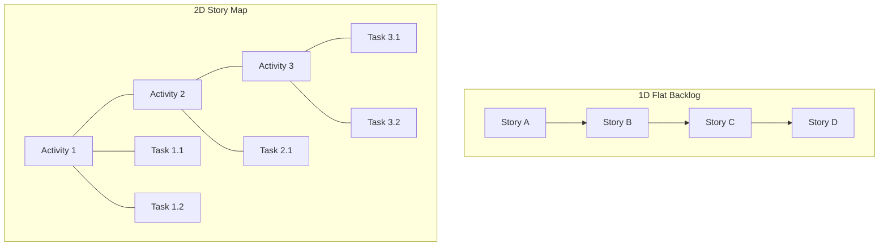
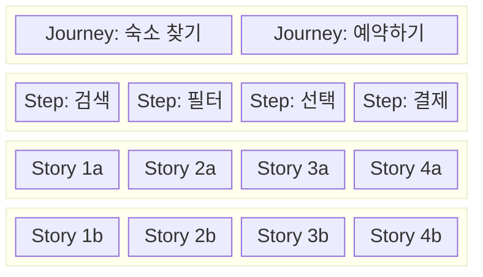

# User Story Map UI in Production Services — 상용 도구들의 레이아웃·인터랙션 패턴

> 작성일: 2026-04-05
> 맥락: 스토리맵 페이지 재구현 전, 상용 서비스의 시각 구조와 인터랙션 패턴을 파악하기 위함

> **Situation** — User Story Map은 Jeff Patton이 2005년 제안한 이래 Agile 팀의 핵심 시각 도구로 자리잡았으며, 현재 10여 개 이상의 상용 도구가 존재한다.
> **Complication** — 각 도구마다 레이아웃·인터랙션이 다르고, "2D 카드 보드"라는 공통점 아래 backbone 구조, 릴리즈 슬라이스, 줌 레벨 등에서 분화가 일어나고 있다.
> **Question** — 상용 스토리맵 도구들의 공통 시각 구조와 차별화 패턴은 무엇인가?
> **Answer** — X축=사용자 여정(backbone), Y축=우선순위(depth)의 2D 그리드가 표준이며, 릴리즈 슬라이스·드래그앤드롭·실시간 협업이 3대 필수 인터랙션이다.

---

## Why — 스토리 맵이 존재하는 이유

플랫 백로그(1D 리스트)는 "전체 사용자 여정에서 이 항목이 어디에 위치하는가"를 보여주지 못한다. Jeff Patton은 이를 해결하기 위해 **2차원 배치**를 제안했다:

- **X축**: 사용자 여정의 시간 흐름 (왼→오)
- **Y축**: 우선순위/상세도 (위→아래)

이 2D 구조 덕분에 **Walking Skeleton** (최소 E2E 기능 집합)을 시각적으로 식별할 수 있다 — 맵 상단을 가로로 잘라낸 첫 번째 수평 슬라이스가 곧 MVP이다.

---

## How — 스토리 맵의 표준 시각 구조

### Backbone (척추) 구조

모든 상용 도구가 공유하는 3계층 구조:

| 계층 | 위치 | 역할 | 예시 |
|------|------|------|------|
| **Journey / Activity** | 최상단 행 | 사용자의 대목표 | "숙소 찾기", "결제하기" |
| **Step / Task** | 2번째 행 | 여정 내 세부 단계 | "검색", "필터링", "비교" |
| **Story** | 3번째 행 이하 | 구현 가능한 단위 | "가격 필터 추가", "지도 뷰" |

### Release Slice (수평 분할)

맵을 가로로 자르는 **수평 영역**이 릴리즈를 나타낸다:

- 최상위 슬라이스 = MVP / Walking Skeleton
- 아래로 갈수록 = 후순위 릴리즈
- 각 슬라이스는 "이 릴리즈에서 전달할 스토리 묶음"

---

## What — 주요 상용 도구 비교

### 1. StoriesOnBoard

**레이아웃**: 가장 정통 Jeff Patton 구조. Goal → Step → Story 3계층 + Release Timeline.

- 카드 기반, 드래그앤드롭으로 재배치
- 자식 카드와 함께 이동 가능 (그룹 드래그)
- 키보드 단축키로 카드 빠르게 생성 (마우스 없이 맵핑 세션 가능)
- 동적 줌으로 관점 전환
- Release Timeline View: 칸반 스타일로 현재 이터레이션에 집중
- 카드에 Business Value, Effort, Priority 필드 부여
- Jira 양방향 동기화

**특징적 UI 패턴**: 무한 캔버스 + 카드 필드 커스터마이징 + 줌 레벨 전환

### 2. Avion

**레이아웃**: Journey → Step → Story 계층. 다크 모드 지원.

- 커스텀 워크플로우 정의 가능 (팀별 프로세스)
- Figma 임베딩 — 카드에 라이브 디자인 직접 첨부
- 여러 스토리 맵 간 연결(cross-map linking)
- 직관적이고 깔끔한 UI (전문 리뷰에서 UX 높은 평가)

**특징적 UI 패턴**: 디자인 임베딩 + 크로스맵 연결 + 워크플로우 커스터마이징

### 3. Miro

**레이아웃**: 무한 캔버스 위의 자유 배치. 템플릿으로 Activity → Task → Story 구조 제공.

- 범용 화이트보드 → 스토리맵은 템플릿 중 하나
- 카드/그룹 이동 시 자동 레이아웃 조정
- 실시간 멀티플레이어 편집
- Jira 이슈 URL 붙여넣기 → 자동 카드화
- Estimation 앱 (t-shirt sizing, 피보나치)

**특징적 UI 패턴**: 무한 캔버스 자유도 + 자동 레이아웃 리플로우 + 다목적 도구

### 4. Easy Agile (Jira 플러그인)

**레이아웃**: Jira 내장형. Epic = backbone, Issue = story.

- **Swimlane 전환**: Sprint swimlane ↔ Version swimlane 토글
- Sprint swimlane: Jira 백로그의 스프린트를 수평 분할로 표시
- Version swimlane: 릴리즈 버전을 수평 분할로 표시
- 스토리맵에서 Version 순서 변경 → Jira Releases 페이지에 자동 동기화
- Layout 버튼으로 Sprint Goal / Version Description 표시 토글

**특징적 UI 패턴**: Jira 네이티브 데이터 활용 + 스윔레인 모드 전환

### 5. FeatureMap

**레이아웃**: 물리적 카드 방식을 디지털로 옮긴 가장 전문화된 도구.

- 카드, 컬럼, 그룹 헤더 기반 구조
- Aggregation 기능: 수평/수직으로 추정치 집계
- 카드 필드 커스터마이징 (Estimation, Budget 등)
- 공개 맵 링크 생성 가능

**특징적 UI 패턴**: 집계(aggregation) + 물리 카드 메타포

### 도구 간 비교 요약

| 도구 | 유형 | backbone 계층 | 릴리즈 표현 | 핵심 차별점 |
|------|------|-------------|-----------|-----------|
| StoriesOnBoard | 전문 도구 | 3 (Goal-Step-Story) | Timeline View | 키보드 중심 빠른 생성 |
| Avion | 전문 도구 | 3 (Journey-Step-Story) | Slice | Figma 임베딩, 크로스맵 |
| Miro | 범용 캔버스 | 3 (Activity-Task-Story) | 자유 배치 | 무한 캔버스 자유도 |
| Easy Agile | Jira 플러그인 | 2 (Epic-Issue) | Swimlane 전환 | Jira 네이티브 동기화 |
| FeatureMap | 전문 도구 | 3 (Group-List-Card) | 컬럼 분할 | 수치 집계(aggregation) |

---

## If — 프로젝트 시사점

현재 프로젝트의 interactive-os 아키텍처를 고려하면:

1. **2D 그리드 = treegrid 또는 kanban 패턴과 유사**
   - backbone(X축)은 탭/컬럼, story(Y축)은 리스트 아이템으로 매핑 가능
   - 기존 `ui/` 컴포넌트(TreeGrid, Kanban) 재활용 여지가 큼

2. **Release Slice = 수평 구분선(swimlane)**
   - NormalizedData의 그룹 노드로 모델링 가능
   - expand/collapse 축으로 슬라이스 접기 지원

3. **3대 필수 인터랙션**
   - 드래그앤드롭: dnd 플러그인 활용
   - 카드 빠른 생성: 키보드 단축키 (StoriesOnBoard 방식)
   - 줌/관점 전환: backbone만 보기 ↔ 전체 보기

4. **데이터 모델**
   - Journey > Step > Story 3계층은 NormalizedData의 parent-children으로 자연스럽게 표현
   - 카드 필드(effort, priority, value)는 노드 속성

---

## Insights

- **Walking Skeleton은 시각적 슬라이스**: MVP가 맵의 "첫 번째 가로줄"로 보인다는 것이 스토리맵의 핵심 가치. 이것이 1D 백로그와 결정적으로 다른 점.
- **전문 도구 vs 범용 캔버스 분화**: StoriesOnBoard/Avion은 구조를 강제하고, Miro는 자유도를 주는 대신 구조가 느슨함. Jira 플러그인은 기존 데이터를 재활용하는 제3의 길.
- **키보드 중심 생성이 숨은 차별점**: StoriesOnBoard의 "마우스 없이 맵핑 세션"은 대부분의 도구가 놓치는 부분. 우리 프로젝트의 키보드 우선 철학과 정확히 맞닿음.
- **Swimlane 모드 전환은 같은 데이터의 다른 뷰**: Easy Agile의 Sprint↔Version 토글은 데이터는 동일한데 수평 분할 기준만 바꾸는 패턴. 이것은 engine의 `getVisibleNodes` + filter로 구현 가능.

---

## Sources

| # | 출처 | 유형 | 핵심 내용 |
|---|------|------|----------|
| 1 | [StoriesOnBoard Features](https://storiesonboard.com/features.html) | 공식 사이트 | Goal-Step-Story 3계층, 키보드 단축키, Release Timeline |
| 2 | [Avion Story Mapping](https://www.avion.io/product/story-mapping/) | 공식 사이트 | Journey-Step-Story, Figma 임베딩, 크로스맵 |
| 3 | [Avion: What is User Story Mapping](https://www.avion.io/what-is-user-story-mapping/) | 가이드 | Backbone/Slice 구조 상세 해설 |
| 4 | [Miro Story Mapping Tool](https://miro.com/strategic-planning/storymapping/) | 공식 사이트 | 무한 캔버스, 자동 레이아웃, Jira 연동 |
| 5 | [Easy Agile Swimlanes](https://help.easyagile.com/easy-agile-teamrhythm/sprint-version-swimlanes) | 도움말 | Sprint/Version 스윔레인 전환 |
| 6 | [Easy Agile Story Map](https://help.easyagile.com/easy-agile-teamrhythm/the-user-story-map-epics-and-issues) | 도움말 | Epic-Issue 2계층, Jira 동기화 |
| 7 | [FeatureMap](https://www.featuremap.co/en) | 공식 사이트 | 카드-컬럼 구조, aggregation 기능 |
| 8 | [Jeff Patton: The New Backlog is a Map](https://jpattonassociates.com/the-new-backlog/) | 원저자 블로그 | 원본 스토리맵 개념, Walking Skeleton |
| 9 | [7 User Story Mapping Tools 2025](https://userstorymap.com/blog/7-user-story-mapping-tools) | 비교 리뷰 | 도구별 기능 비교 |
| 10 | [Top 10 Story Mapping Software 2026](https://gitnux.org/best/user-story-mapping-software/) | 비교 리뷰 | 최신 도구 목록 및 평가 |

---

## Walkthrough

> 이 자료를 프로젝트에서 활용하려면?

1. **기존 ui/ 컴포넌트 확인** — `Kanban`, `TreeGrid`가 2D 그리드 기반이므로 스토리맵 레이아웃에 재활용 가능성 검토
2. **데이터 모델 설계** — NormalizedData로 Journey > Step > Story 3계층 + Release 그룹 모델링
3. **핵심 인터랙션 우선순위** — (1) 키보드 카드 생성, (2) 드래그앤드롭 재배치, (3) 릴리즈 슬라이스 분할
4. **검증 포인트** — Walking Skeleton(첫 번째 수평 슬라이스)이 시각적으로 즉시 식별 가능한가?
