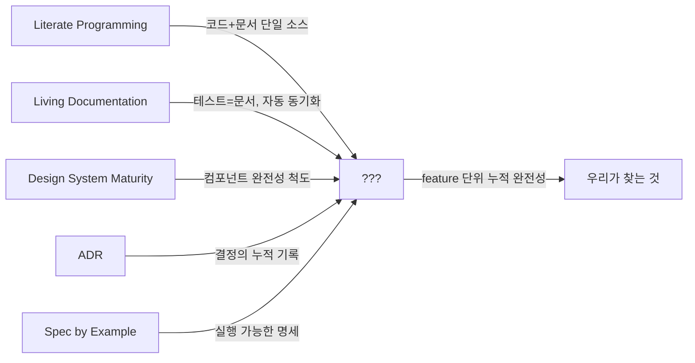
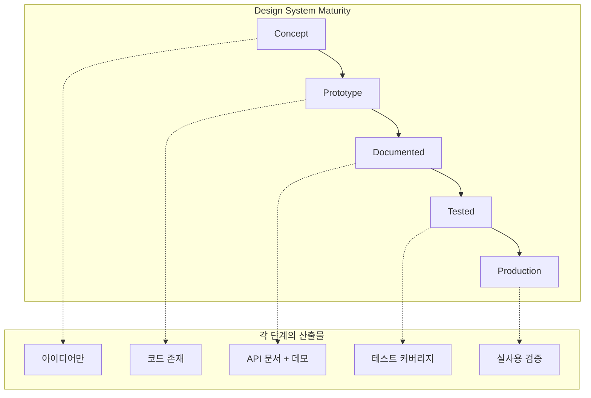
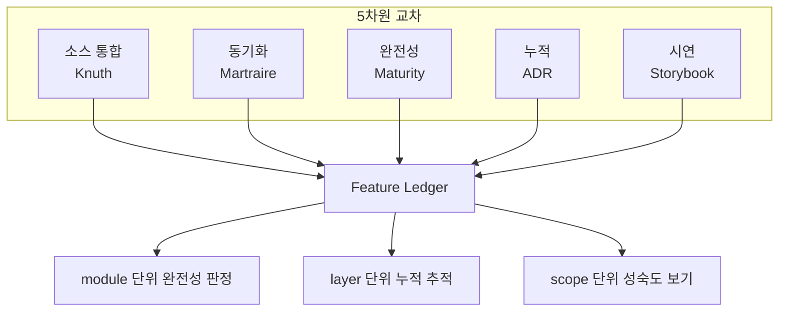

# Feature Ledger — 누적적 자기설명 문서의 기존 개념 지도

> 작성일: 2026-03-25
> 맥락: interactive-os 스킬 파이프라인에서 "MD를 쓰면 끝"을 만들려는데, feature 단위의 누적 관리 개념이 필요

> **Situation** — PRD 32개+를 소비했지만 "ListBox feature는 완전한가?"라는 질문에 답할 수 없다.
> **Complication** — PRD는 한 번의 전진, Area는 구조 기록. 누적된 전진의 합이 "완전한 feature"인지 판정하는 레이어가 없다.
> **Question** — architecture + documentation + demo + test를 feature 단위로 누적 관리하는 기존 개념/방법론이 있는가?
> **Answer** — 정확히 일치하는 단일 개념은 없다. 가장 가까운 3개를 조합하면 윤곽이 잡힌다: Living Documentation(Martraire) + Literate Programming(Knuth) + Design System Maturity Model.

---

## Why — 왜 이런 개념이 필요한가

소프트웨어에서 "feature가 완성됐다"는 판단은 전통적으로 코드 관점(테스트 통과, 배포 완료)에서만 이루어진다. 하지만 라이브러리/디자인 시스템에서는 코드가 존재하는 것만으로는 불충분하다 — **사용자가 발견하고, 이해하고, 신뢰할 수 있어야** 비로소 완성이다.

이 문제를 다루는 기존 개념들은 각각 한 조각만 담당한다:

---

## How — 기존 개념들의 작동 원리

### 1. Literate Programming (Knuth, 1984)

**핵심**: 하나의 소스에서 실행 가능한 코드와 사람이 읽는 문서를 동시에 생성한다.

| 도구 | 입력 | 출력 |
|------|------|------|
| TANGLE | WEB 소스 | 컴파일 가능한 코드 |
| WEAVE | 같은 WEB 소스 | 조판된 문서 |

**우리 프로젝트와의 대응:**
- WEB 소스 = `docs/2-areas/ui/ListBox.md`
- TANGLE = `ShowcaseDemo` (코드 실행)
- WEAVE = `MdPage` (문서 렌더링)

Knuth의 통찰: "프로그램과 문서가 공통 원점을 가지면, 의도(문서)와 행동(코드) 사이의 전통적 간극이 크게 줄어든다."

**한계**: Literate Programming은 단일 프로그램의 코드+문서이지, **여러 PRD의 누적**이나 **feature 완전성 판정**은 다루지 않는다.

### 2. Living Documentation (Cyrille Martraire, 2018)

**핵심**: "대부분의 지식은 이미 존재한다 — 소스 코드에, 테스트에, 애플리케이션의 행위에, 사람들의 머릿속에. 문제는 그것을 찾아서 활용(exploit)하는 것이다."

**4대 원칙:**

| 원칙 | 설명 | 우리 대응 |
|------|------|----------|
| **Reliable** | 코드와 동기화 메커니즘 | MD의 ShowcaseDemo가 실제 컴포넌트를 렌더 |
| **Low-Effort** | 자동화로 최소 비용 | /area, /demo-coverage 스킬 |
| **Collaborative** | 대화에서 지식 도출 | /discuss → /prd 파이프라인 |
| **Insightful** | 비즈니스 의도를 드러냄 | Area MD의 Why 섹션 |

**핵심 개념 — Evergreen Document**: 코드 변경과 동일한 속도로 진화하는 문서. annotation과 convention으로 자동 추출. "테스트가 실패하면 문서도 더 이상 코드와 동기화되지 않았다는 신호."

**한계**: Living Documentation은 "문서가 항상 최신인가?"에 답하지만, **"이 feature에 필요한 모든 문서가 존재하는가?"**에는 답하지 않는다. 동기화(sync) ≠ 완전성(completeness).

### 3. Design System Maturity Model

**핵심**: 컴포넌트가 단계적으로 성숙하며, 각 단계에서 요구하는 산출물이 다르다.

**USWDS 3단계 모델**: Principles → Guidance → Code

**VA.gov 성숙도 척도**: "Completeness means that the documentation of the component or pattern is complete and in sync across the Design System (design.va.gov, Storybook, and Figma library)."

**Storybook/Chromatic 생태계**:
- Story = 데모 + 테스트 + 문서의 단일 소스
- Component Status = 컴포넌트별 완성도 추적
- Visual regression = 시각적 변경 감지

**한계**: 성숙도 모델은 "어디까지 왔는가"를 말하지만, 각 단계의 **구체적 산출물 목록**은 프로젝트마다 다르게 정의해야 한다. 또한 개별 컴포넌트 단위이지, **레이어나 시스템 단위의 누적**은 다루지 않는다.

### 4. Architecture Decision Records (ADR)

**핵심**: 결정의 누적 기록. append-only log.

ADR의 통찰: "각 ADR은 자체 라이프사이클을 가진다. 어떤 것은 상태가 변하고, 어떤 것은 accepted 상태로 남는다."

**우리 대응**: PRD가 ADR과 유사 — 소비되는 연료이되, 결정의 흔적이 남는다. 하지만 ADR은 **결정의 기록**이지, **산출물의 완전성 판정**은 아니다.

### 5. Specification by Example / Executable Specification

**핵심**: "행위의 예시를 문서로 사용하고, 동시에 자동화 테스트로 승격한다."

이것이 우리의 `test = demo = showcase` 원칙과 가장 가까운 기존 개념이다. 하지만 Spec by Example도 **단일 feature의 행위 명세**이지, 여러 feature의 누적을 scope 단위로 관리하는 것은 아니다.

---

## What — 기존 개념의 비교표

| 개념 | 단일 소스 | 코드+문서 동기화 | 데모/시연 | 테스트=문서 | 완전성 판정 | 누적/scope 관리 |
|------|----------|----------------|----------|-----------|-----------|----------------|
| Literate Programming | ✅ | ✅ | ❌ | ❌ | ❌ | ❌ |
| Living Documentation | ⚠️ | ✅ | ❌ | ✅ | ❌ | ❌ |
| Design System Maturity | ❌ | ⚠️ | ✅ | ⚠️ | ✅ | ⚠️ (컴포넌트 단위) |
| ADR | ❌ | ❌ | ❌ | ❌ | ❌ | ✅ (결정 누적) |
| Spec by Example | ⚠️ | ✅ | ⚠️ | ✅ | ❌ | ❌ |
| Storybook | ✅ (story) | ✅ | ✅ | ✅ | ⚠️ | ❌ |
| **우리가 찾는 것** | ✅ | ✅ | ✅ | ✅ | ✅ | ✅ |

마지막 행이 전부 ✅인 기존 개념은 **존재하지 않는다.**

---

## If — 프로젝트에 대한 시사점

### 새로운 개념이 필요하다

기존 개념들은 각각 한 차원만 해결한다:
- Knuth: **소스 통합** (코드+문서)
- Martraire: **동기화** (항상 최신)
- Maturity Model: **완전성** (무엇이 빠졌는가)
- ADR: **누적** (결정의 역사)
- Storybook: **시연** (보여주기)

우리에게 필요한 것은 이 5개 차원의 **교차점**이다:

### 워킹 네임 후보

| 이름 | 비유 | 장점 | 단점 |
|------|------|------|------|
| **Feature Ledger** | 회계 원장 — 거래(PRD)를 누적하여 잔액(완전성)을 산출 | 누적+판정의 의미가 정확 | "장부"가 기술적이지 않음 |
| **Module Manifest** | 선적 목록 — 이 모듈에 있어야 할 것의 체크리스트 | 완전성 의미 명확 | 누적 의미 약함 |
| **Living Inventory** | 살아있는 재고 — Martraire의 living + 재고 관리 | living documentation 계보 | "재고"가 수동적 |
| **Feature Dossier** | 수사 파일 — 한 feature에 대한 모든 증거 모음 | 포괄적 | 무거운 느낌 |
| **Proof Book** | 증명집 — 수학의 proof처럼, 이 feature가 완전하다는 증거의 집합 | 검증+기록 | 테스트에 편향 |

---

## Insights

- **Knuth의 WEB이 가장 가까운 선조다**: 하나의 소스에서 tangle(실행)과 weave(문서)를 동시에 뽑는 구조는 우리의 "MD에서 ShowcaseDemo(실행) + MdPage(문서)"와 정확히 대응한다. 차이는 Knuth는 단일 프로그램 단위이고 우리는 **feature/layer/scope 단위로 확장**한다는 것.

- **Living Documentation의 핵심 빈칸**: Martraire는 "동기화"에 집중하지만 **"완전성"은 빠져 있다**. "문서가 최신인가?"와 "필요한 문서가 전부 있는가?"는 다른 질문이다. 후자가 우리의 핵심 갭.

- **Storybook이 가장 가까운 도구 레벨 선례**: Story = demo + test + doc의 단일 소스. 하지만 Storybook은 **컴포넌트 카탈로그**이지 **아키텍처 문서**가 아니다. 우리는 Layer(store→engine→plugin→axis→pattern→primitive→ui)까지 포괄해야 한다.

- **"기존에 없다"는 것 자체가 의미 있다**: 6개 개념을 교차하면 빈 셀이 나온다는 것은, 이 프로젝트가 정말로 새로운 개념을 필요로 한다는 증거다.

---

## Sources

| # | 출처 | 유형 | 핵심 내용 |
|---|------|------|----------|
| 1 | [Living Documentation — Cyrille Martraire (Leanpub)](https://leanpub.com/livingdocumentation) | 서적 | 4대 원칙(Reliable, Low-Effort, Collaborative, Insightful), Evergreen Document, Knowledge Exploitation |
| 2 | [Q&A with Cyrille Martraire — InfoQ](https://www.infoq.com/articles/book-review-living-documentation/) | 인터뷰 | "대부분의 지식은 이미 존재, 찾아서 활용하는 것이 핵심" |
| 3 | [Literate Programming — Wikipedia](https://en.wikipedia.org/wiki/Literate_programming) | 백과사전 | Knuth의 WEB: tangle+weave, 단일 소스에서 코드와 문서 동시 생성 |
| 4 | [Knuth: Literate Programming (Stanford)](https://www-cs-faculty.stanford.edu/~knuth/lp.html) | 공식 | "프로그램과 문서의 공통 원점이 의도와 행동의 간극을 줄인다" |
| 5 | [USWDS Maturity Model](https://designsystem.digital.gov/maturity-model/) | 공식 스펙 | 3단계(Principles→Guidance→Code), 점진적 채택 |
| 6 | [VA.gov Design System Maturity Scale](https://design.va.gov/about/maturity-scale) | 공식 | "Completeness = 문서가 디자인 시스템 전체에서 완전하고 동기화" |
| 7 | [Self-Documenting Architecture — Nick Tune](https://medium.com/nick-tune-tech-strategy-blog/self-documenting-architecture-80c8c2429cb8) | 블로그 | 코드베이스는 텍스트 파일이 아니라 도메인+비즈니스+아키텍처 정보의 데이터베이스 |
| 8 | [Documentation-Driven Development — GitHub Gist](https://gist.github.com/zsup/9434452) | 원문 | "feature가 문서화되지 않았으면 존재하지 않는 것, 잘못 문서화됐으면 고장난 것" |
| 9 | [How Design Systems Use Storybook — Chromatic](https://www.chromatic.com/blog/how-design-systems-use-storybook/) | 블로그 | Story = demo + test + doc 단일 소스, component status tracking |
| 10 | [Specification by Example — Concordion](https://concordion.org/) | 공식 | 행위 예시를 문서이자 자동화 테스트로 승격 |
| 11 | [Architecture Decision Records — GitHub](https://github.com/joelparkerhenderson/architecture-decision-record) | 레포 | append-only 결정 기록, 라이프사이클 관리 |

---

## Walkthrough

1. 현재 프로젝트에서 Knuth의 WEB 패턴이 작동하는 곳: `docs/2-areas/ui/ListBox.md` → `MdPage`(weave) + `ShowcaseDemo`(tangle)
2. Living Documentation이 작동하는 곳: `ShowcaseDemo`가 실제 컴포넌트를 렌더 → 코드 변경 시 데모도 자동 변경
3. **빠진 곳**: `docs/2-areas/ui/` 23개 MD 중 데모 블록이 있는 것과 없는 것을 비교하면 완전성 갭이 보임
4. 확인 포인트: `/ui/listbox`에서 Demo + Test + Keyboard + Props가 모두 보이면 해당 feature는 "완전". 하나라도 비면 feature ledger에 ❌
