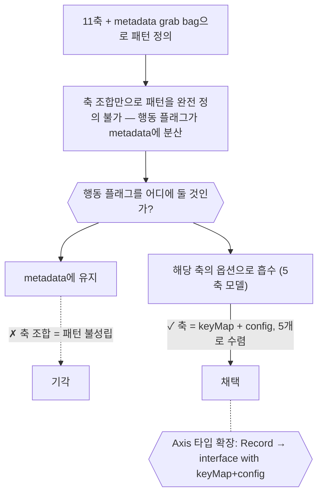
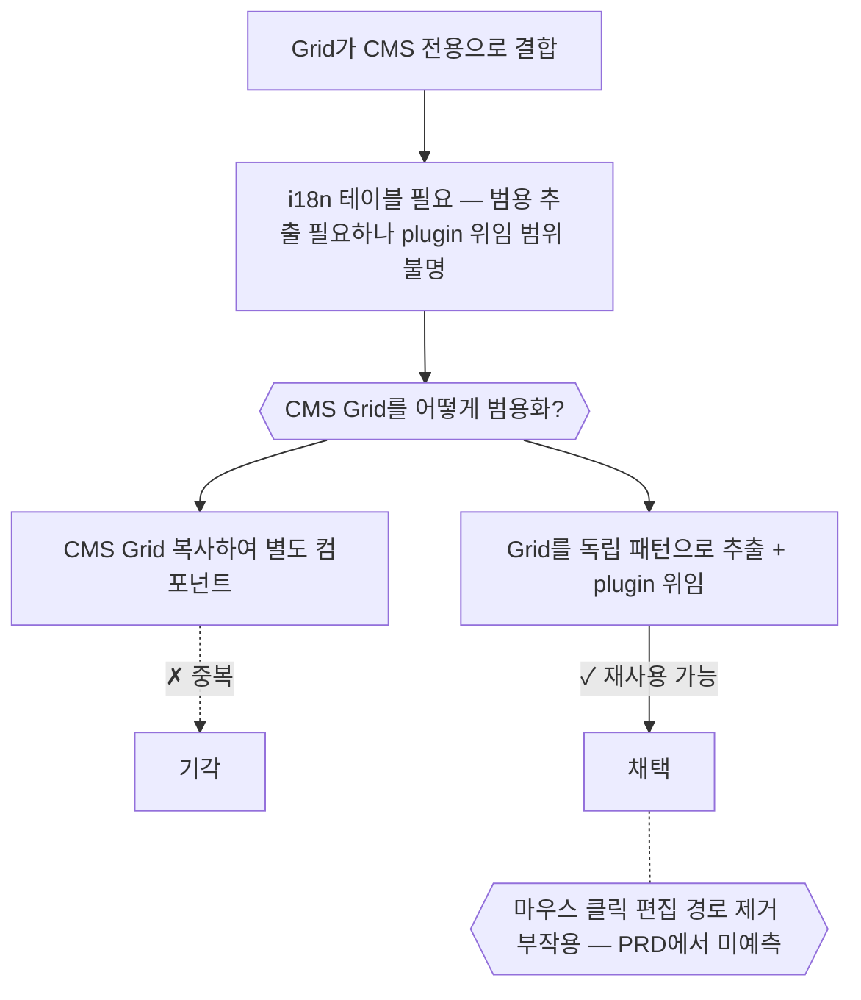
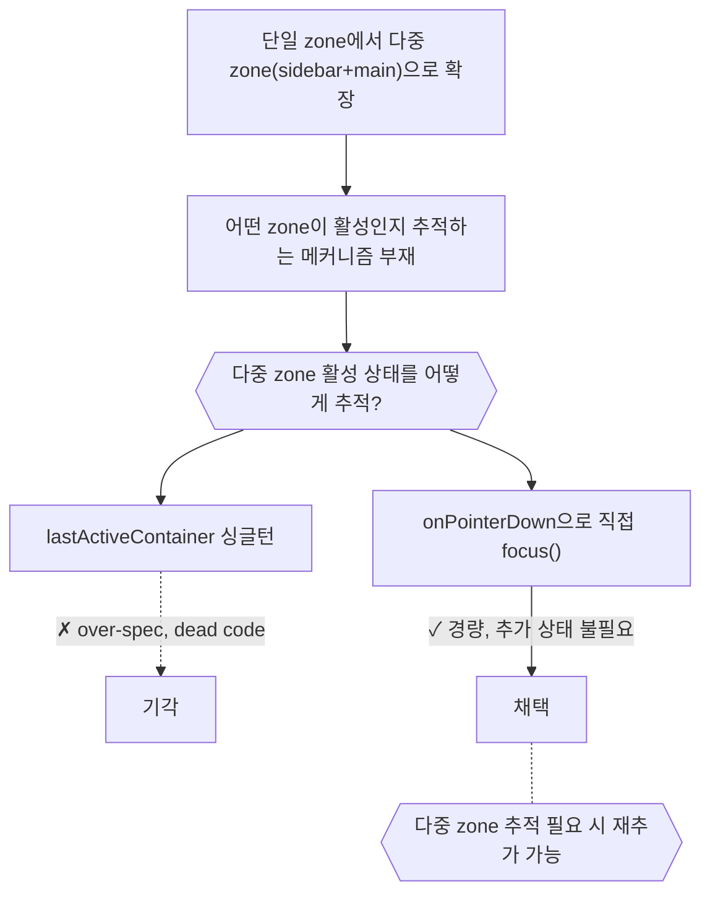
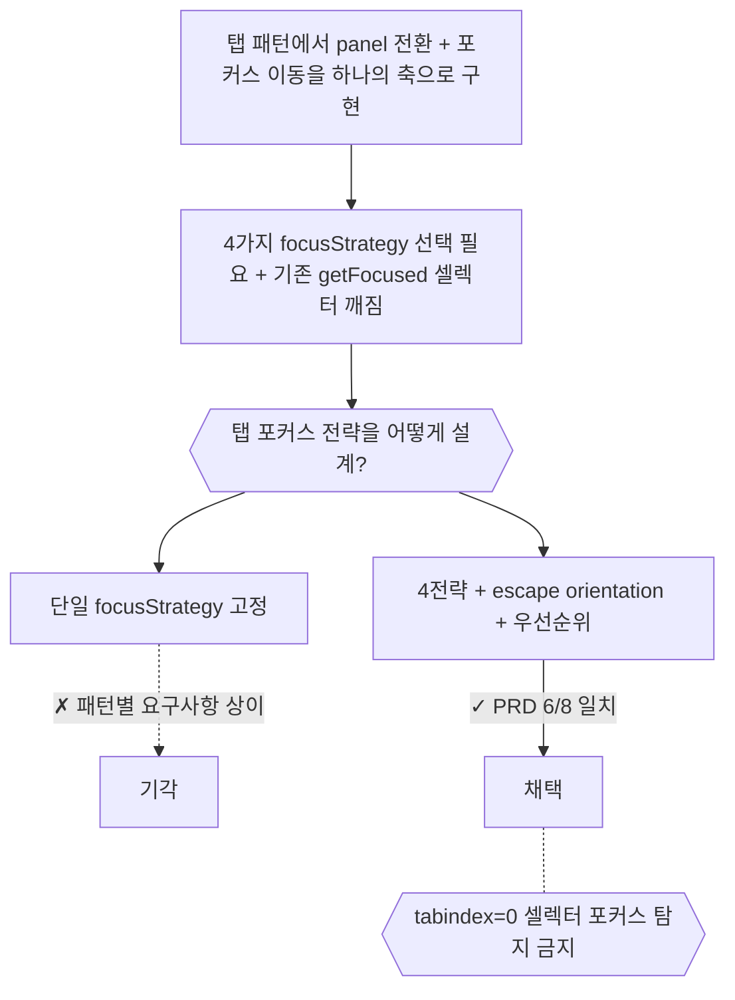

# Axis — 결정 요약

## Axis v2: 11축 → 5축 모델 (2026-03-20)

- 11개 축 + metadata grab bag으로 APG 패턴을 정의하는 구조
- → metadata의 행동 플래그(followFocus, selectionMode 등)가 축 밖에 존재하여, 축 조합만으로 패턴을 완전 정의할 수 없는 상태
- **행동 플래그를 어디에 둘 것인가?**
  - metadata의 행동 플래그를 해당 축의 옵션으로 흡수
  - Axis 타입을 keyMap + config로 확장하여 composePattern이 config를 머지
  - 5축: navigate, select, activate, expand, trap

> 원본: [archive/axisV2FiveAxesModel.md](archive/axisV2FiveAxesModel.md)

---

## Grid 범용화 + i18n Table (2026-03-23)

- Grid가 CMS 전용으로 결합된 상태에서 i18n 테이블도 필요해진 상황
- → Grid를 범용 컴포넌트로 추출해야 하는데, plugin 위임 범위와 테스트 커버리지 갭 발생
- **CMS 결합된 Grid를 어떻게 범용화할 것인가?**
  - Grid를 독립 패턴으로 추출, plugin이 키 동작 소유
  - 일치율 5/8 — 마우스 클릭 편집 경로 제거가 PRD 미예측 부작용

> 원본: [archive/22-[retro]grid-i18n.md](archive/22-[retro]grid-i18n.md)

---

## Active Zone: 다중 zone 포커스 추적 (2026-03-24)

- 단일 zone만 있는 구조에서 다중 zone(sidebar + main)이 필요해진 상황
- → 어떤 zone이 활성인지 추적하는 메커니즘 부재
- **다중 zone 활성 상태를 어떻게 추적할 것인가?**
  - onPointerDown으로 직접 focus() 호출하는 경량 방식 채택
  - lastActiveContainer 싱글턴은 over-spec으로 의도적 제거

> 원본: [archive/34-[retro]active-zone.md](archive/34-[retro]active-zone.md)

---

## Tab Axis: 탭 네비게이션 전략 (2026-03-24)

- 탭 패턴에서 panel 전환 + 포커스 이동을 하나의 축으로 구현해야 하는 상황
- → 4가지 focusStrategy 중 선택 필요, 기존 테스트의 getFocused 셀렉터가 깨지는 연쇄 영향
- **탭 패턴의 포커스 전략을 어떻게 설계할 것인가?**
  - 4전략 + escape orientation + composePattern 우선순위로 해결
  - 교훈: tabindex="0" 셀렉터로 포커스 탐지하면 natural-tab-order에서 깨짐

> 원본: [archive/35-[retro]tab-axis.md](archive/35-[retro]tab-axis.md)
