# interactive-os — Architecture

> Living snapshot. 고정이 아니라 "지금까지 발견된 것"의 스냅샷.
> **갱신 시점:** 레이어 경계 변경, 새 축/플러그인 추가, /retro 시 gap 반영.
> **재료:** naming-dictionary.md (식별자) + PROGRESS.md (maturity) + BACKLOGS.md (gap)

## Thesis

FE 인터랙션 패턴(ARIA APG)과 데이터 조작(CRUD/undo/clipboard/DnD)은 사실상 표준이 수렴했다.
interactive-os는 이 표준을 블록화하는 도구이며, 아키텍처는 그 과정에서 bottom-up으로 발견되고 있다.

## Layer Diagram

```mermaid
graph TB
  subgraph L7["L7 · UI 완성품 — ui/"]
    direction LR
    subgraph L7_UI["표준 UI (15종+)"]
      L7_nav["TreeGrid · ListBox · NavList"]
      L7_layout["TabList · Accordion · DisclosureGroup"]
      L7_input["Combobox · RadioGroup · SwitchGroup · Slider · Spinbutton"]
      L7_action["MenuList · Kanban · Grid"]
      L7_feedback["Toaster · Tooltip"]
    end
    subgraph L7_GAP["🔴 미구현"]
      L7_g["Select · ContextMenu · DatePicker"]
    end
  end

  subgraph L6["L6 · Primitives — primitives/"]
    direction LR
    subgraph L6_comp["Aria 컴포넌트"]
      AriaComp["Aria · Aria.Item · Aria.Cell · Aria.Editable"]
    end
    subgraph L6_hook["코어 hook"]
      useAria_h["useAria — engine+zone 통합 sugar"]
      useZone_h["useAriaZone — zone 단독"]
      useView_h["useAriaView — 뷰 스코프"]
      useCtrl_h["useControlledAria — 외부 상태 연동"]
    end
    subgraph L6_input["입력 처리"]
      useKb["useKeyboard — keyMap→onKeyDown"]
      kmHelpers["keymapHelpers"]
    end
    subgraph L6_reg["레지스트리"]
      ariaReg["ariaRegistry — 글로벌 등록/해제"]
    end
  end

  subgraph L5["L5 · Pattern — pattern/"]
    direction TB
    subgraph L5_compose["합성"]
      compose["composePattern(identity, ...axes) → AriaPattern"]
      ctx["createPatternContext — PatternContext 구현"]
    end
    subgraph L5_types["타입"]
      types5["AriaPattern · NodeState · FocusStrategy"]
    end
    subgraph L5_edit["편집 축"]
      edit["edit — 인라인 편집 keyMap (CRUD/rename/dnd 직접 사용)"]
    end
    subgraph L5_preset["17 Presets (APG 16/19 + kanban)"]
      direction LR
      p_list["listbox · tree · treegrid · grid"]
      p_tabs["tabs · accordion · disclosure"]
      p_menu["menu · dialog · alertdialog · toolbar"]
      p_input["combobox · radiogroup · switch · slider · spinbutton"]
      p_extra["kanban · navlist · spatial"]
    end
    subgraph L5_GAP["🔴 Gap"]
      b_g1["trigger ↔ popup 연결 (menubar · menu button)"]
      b_g2["다계층 keyMap (bar vs dropdown)"]
      b_g3["미구현 APG: Menubar · Carousel · Feed"]
    end
  end

  subgraph L4["L4 · Axis (읽기 전용 7축) — axis/"]
    direction TB
    subgraph L4_axes["7축 (ctx 추상화만 사용)"]
      direction LR
      ax_nav["navigate: vertical · horizontal · both · grid"]
      ax_depth["expand: depthArrow · depthEnterEsc"]
      ax_sel["select: selectToggle · selectExtended"]
      ax_act["activate: activate · activateFollowFocus"]
      ax_dismiss["dismiss: Escape → collapse"]
      ax_val["value: increment · decrement · clamp"]
      ax_tab["tab: native · flow · loop · escape"]
    end
    subgraph L4_types["계약 타입"]
      ax_types["PatternContext · KeyMap · AxisConfig · StructuredAxis"]
    end
  end

  subgraph L3["L3 · Plugin — plugins/"]
    direction TB
    subgraph L3_define["플러그인 정의"]
      definePlugin["definePlugin — intercepts/requires · zodSchema"]
    end
    subgraph L3_core["core — 포커스 · 셀렉션 · 확장"]
      direction LR
      cmd_focus["focusCommands: next · prev · first · last · parent · child"]
      cmd_sel["selectionCommands: toggle · select · selectRange · selectAll · clear · extend · setAnchor"]
      cmd_expand["expandCommands: expand · collapse · toggle"]
      cmd_gcol["gridColCommands: setGridCol"]
    end
    subgraph L3_data["데이터 조작"]
      direction LR
      cmd_crud["crud: moveNode · insertNode · add · remove"]
      cmd_clip["clipboard: copy · cut · paste · CanAcceptFn"]
      cmd_rename["rename: startRename · confirmRename · cancelRename"]
      cmd_dnd["dnd: moveUp · moveDown · moveOut · moveIn"]
    end
    subgraph L3_enhance["보강"]
      direction LR
      cmd_hist["history: undo · redo · command stack"]
      cmd_spatial["spatial: findNearest · findAdjacentGroup · useSpatialNav"]
      cmd_type["typeahead: findTypeaheadMatch · resetTypeahead"]
      cmd_recovery["focusRecovery: findFallbackFocus · IsReachable"]
    end
    subgraph L3_GAP["🔴 Gap"]
      p_g1["permissions (concept only)"]
      p_g2["직렬화/역직렬화 (load · save 범용)"]
    end
  end

  subgraph L2["L2 · Engine — engine/"]
    direction LR
    subgraph L2_dispatch["디스패치"]
      eng_create["createCommandEngine"]
      eng_dispatch["dispatch(command) → state'"]
      eng_batch["createBatchCommand — 다중 커맨드 원자 실행"]
    end
    subgraph L2_mid["미들웨어"]
      eng_mw["Middleware 체인"]
      eng_logger["dispatchLogger · Logger"]
    end
    subgraph L2_hook["React 연결"]
      eng_hook["useEngine — engine 생성 hook"]
    end
    subgraph L2_types["타입"]
      eng_types["Command · BatchCommand · Middleware"]
    end
  end

  subgraph L1["L1 · Store — store/"]
    direction LR
    subgraph L1_struct["구조"]
      store_nd["NormalizedData — flat entities map"]
      store_entity["Entity — id + data"]
      store_root["ROOT_ID"]
      store_create["createStore — CRUD 연산"]
    end
    subgraph L1_read["읽기"]
      store_get["getEntity · getEntityData · getChildren · getParent"]
      store_tree["storeToInspectorTree — flat → tree 변환"]
    end
    subgraph L1_write["쓰기"]
      store_add["addEntity · removeEntity"]
      store_upd["updateEntity · updateEntityData"]
    end
    subgraph L1_diff["변경 감지"]
      store_diff["computeStoreDiff · StoreDiff"]
    end
    subgraph L1_GAP["🔴 Gap"]
      s_g1["직렬화 (serialize · deserialize)"]
      s_g2["스키마 검증 (validateNode 범용화)"]
    end
  end

  subgraph DT["Devtools — cross-cutting · devtools/"]
    direction LR
    dt_rec["REC — ARIA tree 스냅샷 재현 녹화"]
    dt_insp["Inspector — Store 라이브 탐색"]
    dt_test["Test Runner — 브라우저 vitest"]
  end

  L7 --> L6
  L6 --> L5
  L5 --> L4
  L4 --> L3
  L3 --> L2
  L2 --> L1
  DT -.->|observes| L1
  DT -.->|observes| L2
  DT -.->|observes| L7

  style L7 fill:#fff8f0,stroke:#a85,stroke-width:2px
  style L6 fill:#fff8f0,stroke:#a85,stroke-width:2px
  style L5 fill:#f0fff0,stroke:#5a5,stroke-width:2px
  style L4 fill:#f0fff0,stroke:#5a5,stroke-width:2px
  style L3 fill:#f0fff0,stroke:#5a5,stroke-width:2px
  style L2 fill:#f0f8ff,stroke:#58a,stroke-width:2px
  style L1 fill:#f0f8ff,stroke:#58a,stroke-width:2px
  style L7_GAP fill:#fff3f3,stroke:#e55
  style L5_GAP fill:#fff3f3,stroke:#e55
  style L3_GAP fill:#fff3f3,stroke:#e55
  style L1_GAP fill:#fff3f3,stroke:#e55
  style DT fill:#f5f0ff,stroke:#85a,stroke-width:2px,stroke-dasharray: 5 5
```

## Layer Summary

| 색상 | 레이어 | 디렉토리 | 파일 수 | 역할 | 렌더러 독립 |
|------|--------|----------|--------|------|------------|
| 🔵 | L1 Store | `store/` | 4 | 데이터 구조 + CRUD | ✅ |
| 🔵 | L2 Engine | `engine/` | 6 | 커맨드 디스패치 + 미들웨어 + useEngine + getVisibleNodes | ✅ (useEngine 제외) |
| 🟢 | L3 Plugin | `plugins/` | 14 | 데이터 조작 표준 (definePlugin + useSpatialNav) | ✅ (useSpatialNav 제외) |
| 🟢 | L4 Axis | `axis/` | 8 | 읽기 전용 축 7종 + 계약 타입 (PatternContext, KeyMap) | ✅ |
| 🟢 | L5 Pattern | `pattern/` | 23 | composePattern + edit + 17 presets + createPatternContext | ✅ |
| 🟠 | L6 Primitives | `primitives/` | 9 | Aria 컴포넌트 + hook + 레지스트리 | ❌ (React) |
| 🟠 | L7 UI | `ui/` | 35 | 표준 UI 완성품 (15종+) | ❌ (React) |
| 🔴 | 각 레이어 GAP | — | — | 안개 영역 | — |
| ⚙️ | Devtools (cross-cutting) | `devtools/` | 11 | REC · Inspector · Test Runner | ❌ (브라우저) |

**의존 방향:** L7 → L6 → L5 → L4 → L3 → L2 → L1 (단방향, 하위 레이어는 상위를 모름)

**알려진 레이어 위반:** 없음

## Key Renames (from v1 architecture)

| Before | After | 비고 |
|--------|-------|------|
| `AriaBehavior` | `AriaPattern` | L5 Pattern 산출물 타입 |
| `BehaviorContext` | `PatternContext` | L4 Axis 계약 타입 |
| `createBehaviorContext` | `createPatternContext` | L5 Pattern 팩토리 |
| `behaviors/` | `pattern/` | L5 디렉토리 |
| `axes/` | `axis/` | L4 디렉토리 (복수→단수) |
| `hooks/` + `components/` | `primitives/` | L6 디렉토리 통합 |
| `core/` | `store/` + `engine/` | L1 + L2 분리 |

## Companion Documents

| 문서 | 역할 | 이 문서와의 관계 |
|------|------|----------------|
| `PROGRESS.md` | 모듈 maturity + gap | 레이어 안의 모듈 상태 |
| `BACKLOGS.md` | 미해결 과제 | 🔴 Gap의 상세 |
| `.claude/naming-dictionary.md` | 식별자 전수 목록 | 레이어 내부 채우기 재료 |
