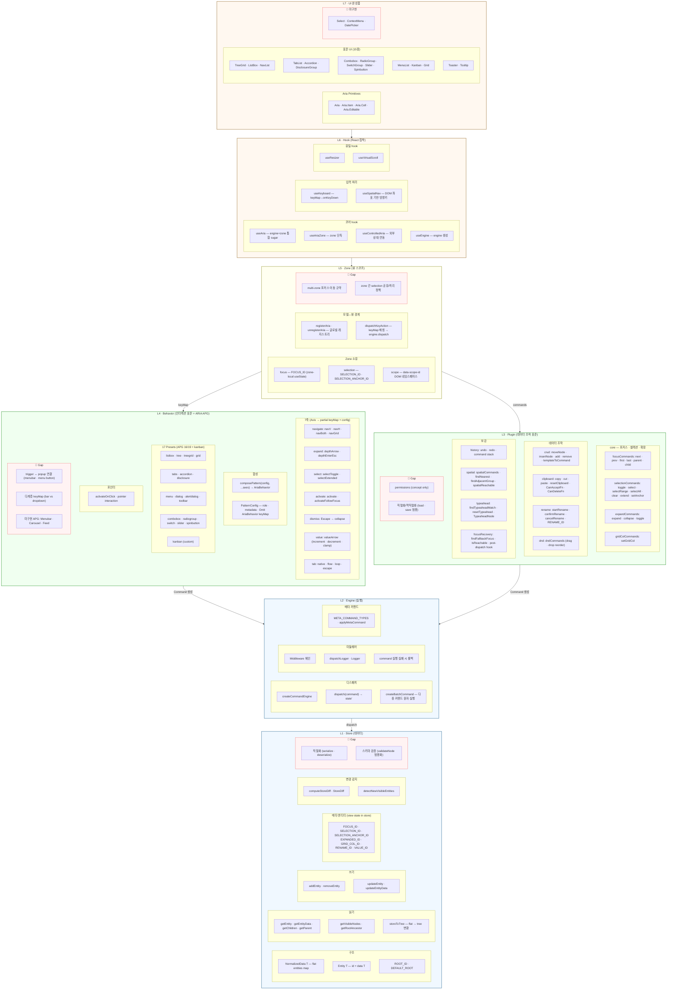

# interactive-os — Architecture

> Living snapshot. 고정이 아니라 "지금까지 발견된 것"의 스냅샷.
> **갱신 시점:** 레이어 경계 변경, 새 축/플러그인 추가, /retro 시 gap 반영.
> **재료:** naming-dictionary.md (식별자) + PROGRESS.md (maturity) + BACKLOGS.md (gap)

## Thesis

FE 인터랙션 패턴(ARIA APG)과 데이터 조작(CRUD/undo/clipboard/DnD)은 사실상 표준이 수렴했다.
interactive-os는 이 표준을 블록화하는 도구이며, 아키텍처는 그 과정에서 bottom-up으로 발견되고 있다.

## Layer Diagram

## Layer Summary

| 색상 | 레이어 | 역할 | 렌더러 독립 |
|------|--------|------|------------|
| 🔵 | L1 Store · L2 Engine | 데이터 + 실행 | ✅ |
| 🟢 | L3 Plugin · L4 Behavior | FE 표준 블록화 (조작 + 인터랙션) | ✅ |
| 🟡 | L5 Zone | 모델↔뷰 경계 | ❌ (React) |
| 🟠 | L6 Hook · L7 UI | React 접착 + 완성품 | ❌ (React) |
| 🔴 | 각 레이어 GAP | 안개 영역 | — |

**의존 방향:** L7 → L6 → L5 → (L4 + L3) → L2 → L1 (단방향, 하위 레이어는 상위를 모름)

## Companion Documents

| 문서 | 역할 | 이 문서와의 관계 |
|------|------|----------------|
| `PROGRESS.md` | 모듈 maturity + gap | 레이어 안의 모듈 상태 |
| `BACKLOGS.md` | 미해결 과제 | 🔴 Gap의 상세 |
| `.claude/naming-dictionary.md` | 식별자 전수 목록 | 레이어 내부 채우기 재료 |
