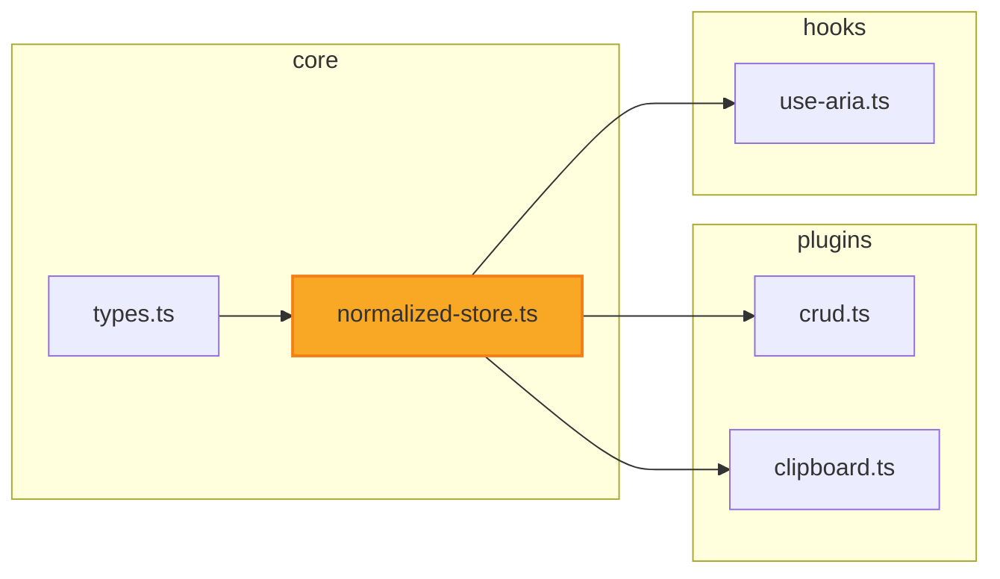

# Viewer Dependency Graph — PRD

> Discussion: Viewer에서 파일을 열면 해당 파일 중심의 1-depth import 의존 관계를 mermaid 그래프로 코드 위에 시각화

## 1. 동기

| # | Given | When | Then |
|---|-------|------|------|
| 1 | Viewer에서 소스 파일을 열고 있다 | 이 파일이 전체 아키텍처에서 어디에 위치하는지 알고 싶다 | 코드 위에 mermaid 의존 그래프가 보여서 imports/importedBy 관계를 즉시 파악할 수 있다 |
| 2 | 의존 그래프의 노드를 보고 있다 | 연결된 파일로 이동하고 싶다 | 노드 클릭 시 해당 파일이 Viewer에 열린다 |
| 3 | 코드가 변경되었다 | 설계도를 다시 보고 싶다 | 별도 빌드 없이 파일을 다시 열면 최신 import 관계가 반영된다 (런타임 동적 파싱) |

상태: 🟢

## 2. 인터페이스

> 산출물: 코드 위 mermaid 그래프 (세로 배치 — 그래프 → 코드). 그래프 내부는 가로 배치 (graph LR).

| 입력 | 조건 | 결과 |
|------|------|------|
| 파일 트리에서 .ts/.tsx/.js/.jsx 파일 선택 | 소스 파일이다 | 코드 위에 1-depth mermaid 의존 그래프 표시 |
| 파일 트리에서 .md/.json/.css 등 선택 | 비-소스 파일이다 | 그래프 영역 없이 기존 동작 유지 (마크다운/코드블록만) |
| mermaid 그래프의 노드 클릭 | 해당 파일이 프로젝트 내 존재 | `selectFile(path)` 호출 → 해당 파일 열림 + 새 그래프 갱신 |
| mermaid 그래프의 노드 클릭 | 외부 패키지 (node_modules) | 클릭 무시 (외부 패키지는 그래프에 표시하지 않음) |
| ↑↓ 키 | 파일 트리에 포커스 | 기존 treegrid 네비게이션 (변경 없음) |
| ←→ 키 | N/A | 그래프 자체는 키보드 인터랙션 없음 (읽기 전용 시각화) |
| Enter | 파일 트리에 포커스 | 기존 동작 (폴더 열기/닫기) |
| Escape | N/A | 기존 동작 |
| Space / Tab / Home / End | N/A | 기존 동작 유지 |
| Cmd/Ctrl 조합 | N/A | 기존 Cmd+P Quick Open 유지 |
| 클릭 | 그래프 노드 위 | 해당 파일로 이동 |
| 클릭 | 그래프 빈 영역 | 아무 동작 없음 |
| 이벤트 버블링 | 그래프가 코드 블록 위에 위치 | 별도 div 영역이므로 버블링 이슈 없음 |

상태: 🟢

## 3. 산출물

> 구조, 관계, 이름 — 파일/컴포넌트/데이터 스키마

### 서버: `/api/fs/imports` 엔드포인트 (`vite-plugin-fs.ts`)

- 입력: `?path=/absolute/path/to/file.ts`
- 출력 JSON:
  ```json
  {
    "file": "src/interactive-os/core/normalized-store.ts",
    "layer": "core",
    "imports": [
      { "path": "src/interactive-os/core/types.ts", "layer": "core" }
    ],
    "importedBy": [
      { "path": "src/interactive-os/plugins/crud.ts", "layer": "plugins" },
      { "path": "src/interactive-os/plugins/clipboard.ts", "layer": "plugins" },
      { "path": "src/interactive-os/hooks/use-aria.ts", "layer": "hooks" }
    ]
  }
  ```
- 레이어 판정: `src/interactive-os/{layer}/` 경로에서 추출. `src/pages/` → "pages"
- importedBy: `src/` 전체 스캔 + 결과 캐시 (파일 변경 시 invalidate)

### 클라이언트: Viewer 코드 블록 상단 mermaid 영역 (`PageViewer.tsx`)

- 파일 선택 시 `/api/fs/imports` fetch
- 응답으로 mermaid `graph LR` 문법 동적 생성
- 기존 `<MermaidBlock>` 컴포넌트로 렌더링
- 코드 블록(`<CodeBlock>`) 위에 배치

### mermaid 출력 예시



상태: 🟢

## 4. 경계

| 조건 | 예상 동작 |
|------|----------|
| 파일에 import문이 0개 | 그래프에 현재 파일 노드만 표시 (importedBy는 있을 수 있음) |
| importedBy가 0개 | 그래프에 imports 방향만 표시 |
| imports + importedBy 합계가 20+개 | 전부 표시 (1-depth라서 실제 20+ 드묾, mermaid 자동 레이아웃) |
| `import type` (타입 전용 import) | 포함한다 (의존 관계는 동일) |
| dynamic import (`import()`) | 포함한다 (정규식으로 잡을 수 있고 의존 관계 동일) |
| re-export (`export { x } from './y'`) | import로 취급한다 |
| 순환 의존 (A→B→A) | 양방향 화살표로 표시, 무한루프 없음 (1-depth 제한) |
| `src/` 밖 파일 (e.g., vite.config.ts) | 레이어 "root"로 표시 |
| 비-JS/TS 파일 열기 (.css, .json, .md) | 그래프 영역 자체를 표시하지 않음 |

상태: 🟢

## 5. 금지

| # | 하면 안 되는 것 | 이유 |
|---|---------------|------|
| 1 | 외부 패키지(node_modules) import를 그래프에 표시 | 노이즈. 프로젝트 내부 구조를 보려는 것 |
| 2 | prebuild 스크립트 도입 | Discussion에서 확정: 런타임 동적 파싱. dev 서버 API로 해결 |
| 3 | AST 파서(ts-morph 등) 의존성 추가 | 정규식으로 충분. import문은 패턴이 단순함 |
| 4 | 그래프에 키보드 인터랙션 추가 | 읽기 전용 시각화. 포커스 관리 복잡성 불필요 |
| 5 | 2-depth 이상 표시 (1단계에서) | Discussion에서 1-depth만으로 1단계 확정 |

상태: 🟢

## 6. 검증

| # | 시나리오 | 예상 결과 |
|---|---------|----------|
| 1 | `core/normalized-store.ts` 열기 | 코드 위에 mermaid 그래프: types.ts ← normalized-store.ts → crud.ts, clipboard.ts 등. 레이어 subgraph 구분 |
| 2 | 그래프에서 `crud.ts` 노드 클릭 | Viewer가 crud.ts를 열고, 새로운 그래프가 crud.ts 중심으로 갱신 |
| 3 | `README.md` 열기 | 그래프 영역 없이 마크다운 렌더링만 |
| 4 | import 0개인 파일 열기 | 현재 파일 노드 + importedBy만 표시 |
| 5 | 코드 수정 후 파일 다시 열기 | prebuild 없이 변경된 import 관계 반영 |
| 6 | `pages/PageViewer.tsx` 열기 (import 많은 파일) | 모든 1-depth 관계가 레이어별 subgraph로 표시 |

상태: 🟢

---

**전체 상태:** 🟢 6/6
