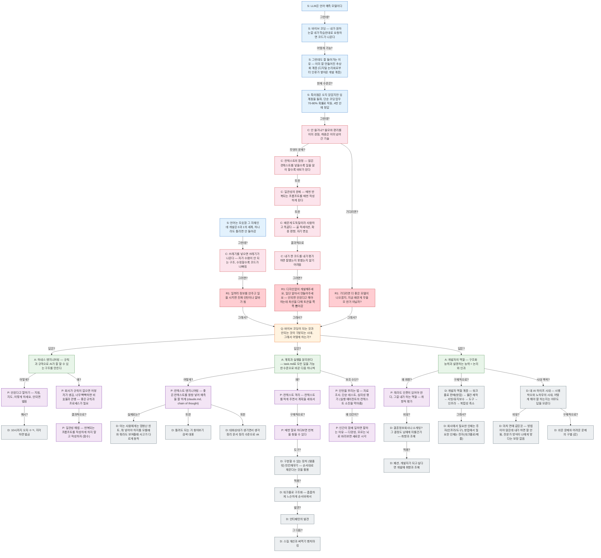

# AI 시대 하네스 엔지니어링 특강

## 피라미드

<!-- 이하 자동 생성 — 직접 수정 금지 -->

## 산문 검증

### Lv.1 메시지 흐름

- LLM은 언어 예측 모델이다
- 언어는 모호함 그 자체인데 개발은 0과 1의 세계, 하나라도 틀리면 안 돌아감
- **그런데?** 바이브 코딩 — 내가 원하는걸 네가 학습한대로 요청하면 코드가 나온다
- **그런데?** 쓰레기를 넣으면 쓰레기가 나온다 — 자가 수렴이 안 되는 구조, 수정할수록 코드가 나빠짐
- **어떻게 가능?** 그런데도 잘 돌아가는 이유 — 이미 잘 만들어진 추상화 계층 (디지털 논리회로부터 인류가 쌓아온 개발 계층)
- **그러면?** 일부러 정보를 안주고 일을 시키면 진짜 인턴이나 알바가 됨
- **현재 수준은?** 특이점은 오지 않았지만 임계점을 돌파, 단순 코딩 업무 70-80% 확률로 작동, 4번 안에 정답
- **그래서?** 바이브 코딩이 되는 것과 안되는 것이 구분되는 시대, 그래서 어떻게 하는가?
- **그런데?** 안 쓸거냐? 쓸모와 편리를 이미 경험, 캐즘은 이미 넘어간 기술
- **답은?** 하네스 엔지니어링 — 규칙과 규격으로 AI가 잘 할 수 있는 구조를 만든다
- **답은?** 계획과 실행을 분리한다 — task.md로 모든 일을 가능한 수준으로 바꾼 다음 하나씩
- **답은?** 개발자의 역할 — 구조화 능력과 설명하는 능력 = 논리와 인과
- **무엇이 문제?** 컨텍스트의 함정 — 많은 컨텍스트를 넣을수록 일을 많이 할수록 바보가 된다
- **기다리면?** 기다리면 더 좋은 모델이 나오겠지, 지금 배운게 무쓸모 한거 아닐까?
- **또한** 일관성의 문제 — 매번 반복되는 프롬프트를 매번 작성하게 된다
- **또한** 배운게 도둑질이라 사람하고 똑같다 — 골 픽세이션, 확증 편향, 자기 변호
- **결과적으로** 내가 짠 코드를 내가 평가하면 잘했는지 못했는지 알기 어려움
- **그러면?** 디자인없이 개발해주세요, 일단 알아서 만들어주세요 — 안되면 안된다고 해야 하는데 최선을 다해 토큰을 쪽쪽 뽑아감

### Lv.2 전체 글

## 프롤로그

- LLM은 언어 예측 모델이다
- 언어는 모호함 그 자체인데 개발은 0과 1의 세계, 하나라도 틀리면 안 돌아감
- **그런데?** 바이브 코딩 — 내가 원하는걸 네가 학습한대로 요청하면 코드가 나온다
- **그런데?** 쓰레기를 넣으면 쓰레기가 나온다 — 자가 수렴이 안 되는 구조, 수정할수록 코드가 나빠짐
- **어떻게 가능?** 그런데도 잘 돌아가는 이유 — 이미 잘 만들어진 추상화 계층 (디지털 논리회로부터 인류가 쌓아온 개발 계층)

### **그러면?** 일부러 정보를 안주고 일을 시키면 진짜 인턴이나 알바가 됨

- **현재 수준은?** 특이점은 오지 않았지만 임계점을 돌파, 단순 코딩 업무 70-80% 확률로 작동, 4번 안에 정답

## **그래서?** 바이브 코딩이 되는 것과 안되는 것이 구분되는 시대, 그래서 어떻게 하는가?

- **그런데?** 안 쓸거냐? 쓸모와 편리를 이미 경험, 캐즘은 이미 넘어간 기술

### **답은?** 하네스 엔지니어링 — 규칙과 규격으로 AI가 잘 할 수 있는 구조를 만든다

  - **어떻게?** 안된다고 말하기 — 지침, 지도, 이렇게 하세요, 안되면 벌점
    - **예시?** 10시까지 오자 ㅇㅋ, 지각하면 벌금
  - **왜?** 회사가 규칙이 없으면 어뷰저가 생김, 너무 빡빡하면 비효율과 관행 — 좋은 규칙과 프로세스가 필요
    - **결과적으로?** 일관성 해법 — 반복되는 프롬프트를 작성하게 하지 말고 작성하자 (함수)

### **답은?** 계획과 실행을 분리한다 — task.md로 모든 일을 가능한 수준으로 바꾼 다음 하나씩

  - **어떻게?** 컨텍스트 엔지니어링 — 좋은 컨텍스트를 왕창 넣어 예측을 잘 하게 (claude.md, chain of thought)
    - **실제로는?** 아는 사람에게는 엄청난 힌트, 뭐 넣어야 하지를 모를때와 뭐라도 보여줄때 사고가 다르게 동작
    - **또한** 틀려도 되는 거 찾아보기 검색 대용
    - **또한** 대화상대가 생기면서 생각정리 문서 정리 수준으로 ok
  - **왜?** 컨텍스트 격리 — 컨텍스트를 적게 주면서 계획을 세워서
    - **구체적으로?** 매번 말로 하다보면 반복을 찾을 수 있다
      - **도구?** 구분할 수 있는 장치 (템플릿) 빈칸채우기 — 순서대로 채운다는 것을 활용
        - **적용?** 워크플로 구조화 — 촘촘하게 느슨하게 순서바꿔서
          - **발견?** 안티패턴의 발견
            - **그 다음?** 스킬 개선과 써먹기 벤치마킹
  - **보조 수단?** 인턴을 부리는 법 — 자료조사, 단순 테스트, 심미성 평가 (실행 에이전트의 컨텍스트 소진을 막아줌)
    - **왜 인간이?** 인간이 함께 일하면 잘하는 이유 — 다양성, 모르는 뇌로 바라보면 새로운 시각

### **답은?** 개발자의 역할 — 구조화 능력과 설명하는 능력 = 논리와 인과

  - **왜 취향?** 뭐라도 인풋이 있어야 한다, 그걸 내가 하는 역할 — 취향적 평가
    - **비유?** 결혼정보회사나 소개팅? 그 결정도 남에게 미룰건가 — 취향과 조예
      - **적용?** 패션, 개발자가 되고 싶다면 개발에 취향과 조예
  - **구체적으로?** 개발자 역할 계층 — 워크플로 판매(창업) → 물건 제작 → 서빙/유지보수 → 도구 → 인프라 → 복잡성 축소
    - **그래서?** 회사에서 필요한 인재는 후자(인프라/도구), 창업에서 필요한 인재는 전자(워크플로/제품)
  - **시대 맥락?** 대 AI 하이프 시대 — 시행착오와 노하우의 시대, 어떻게 해야 잘 하는지는 아무도 답을 모른다
    - **비유?** 마치 연애 같은것 — 방법이야 많은데 내가 하면 잘 안됨, 전문가 방식이 나에게 맞다는 보장 없음
    - **구체적으로?** 쉬운 문제와 어려운 문제의 구별 (감)
- **무엇이 문제?** 컨텍스트의 함정 — 많은 컨텍스트를 넣을수록 일을 많이 할수록 바보가 된다

### **기다리면?** 기다리면 더 좋은 모델이 나오겠지, 지금 배운게 무쓸모 한거 아닐까?

- **또한** 일관성의 문제 — 매번 반복되는 프롬프트를 매번 작성하게 된다
- **또한** 배운게 도둑질이라 사람하고 똑같다 — 골 픽세이션, 확증 편향, 자기 변호
- **결과적으로** 내가 짠 코드를 내가 평가하면 잘했는지 못했는지 알기 어려움

### **그러면?** 디자인없이 개발해주세요, 일단 알아서 만들어주세요 — 안되면 안된다고 해야 하는데 최선을 다해 토큰을 쪽쪽 뽑아감

## 통계

📐 피라미드 현황: S5 C6 Q1 R13 R20 A3 K0 P9 D15
📊 엣지: 42개

## 고아 노드

없음

## 갭

- [ ] A3의 P 부족 (1개) — MECE를 위해 2개 이상 필요
- [ ] P6에 D 없음 — 구체적 예시/데이터 필요
- [ ] P9에 D 없음 — 구체적 예시/데이터 필요
- [ ] 📏 C6(안 쓸거냐? 쓸모와 편리를 이미 경험…) 자식 깊이 불균형 — C2(깊이12) vs R3(깊이8), 차이 4
- [ ] 📏 Q1(바이브 코딩이 되는 것과 안되는 것이…) 자식 깊이 불균형 — A2(깊이6) vs A1(깊이2), 차이 4
- [ ] 📏 A2(계획과 실행을 분리한다 — task.…) 자식 깊이 불균형 — P2(깊이5) vs P1,P3(깊이1), 차이 4
- [ ] 🏗️ S 타입 위계 불일치 — S1@0,S3@0 vs S5@3, depth 차이 3
- [ ] 🏗️ C 타입 위계 불일치 — C1@1 vs C5@8, depth 차이 7
- [ ] 🏗️ R1 타입 위계 불일치 — R1@2 vs R2@9, depth 차이 7
- [ ] 🏗️ D 타입 위계 불일치 — D12@5,D14@5 vs D8@10, depth 차이 5
- [ ] 📊 슬라이드 밸런스 — A2(12줄) vs A1(4줄), 3.0배 차이. 무거운 쪽 서브 슬라이드 분할 검토
